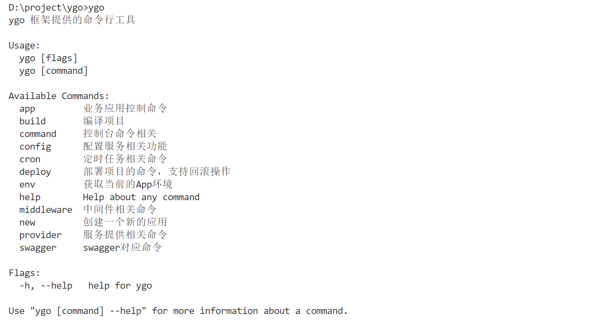
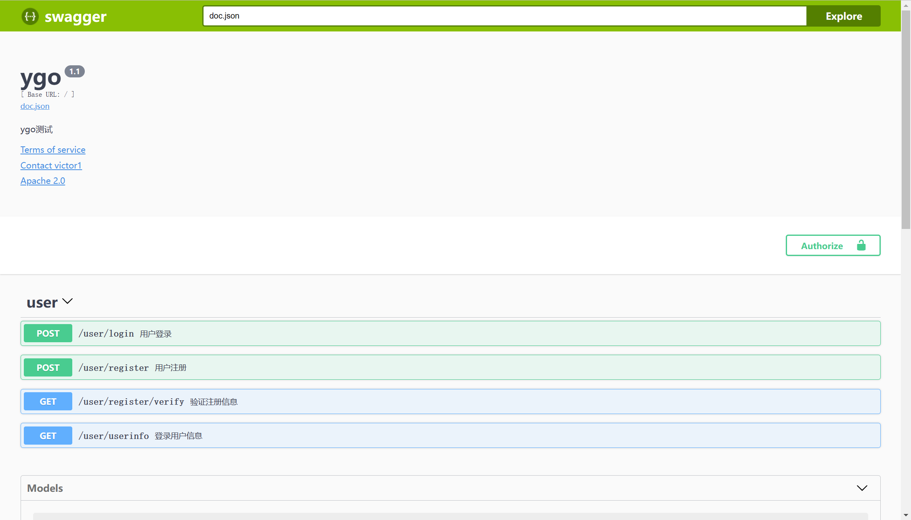

# Ygo

参考[hade框架](http://hade.funaio.cn)进行二次开发， Ygo框架是一套内置了orm、web server、swagger
接口管理等多种基础服务，win/linux跨系统可用，支持丰富命令行工具的go服务端开发框架

1. Web Server：Ygo基于Gin进行扩展，支持Gin丰富的web server开发功能与中间件，框架还提供了调试模式和完善的web服务管理能力
2. 命令行工具：Ygo封装了cobra，并内置了丰富的框架命令，以交互的方式提供框架功能，提高了用户的使用体验，同时支持用户扩展自己的命令行工具。
3. 基于协议的服务实现与管理：Ygo使用全局容器管理框架内的服务，在业务服务的具体开发中，只需按照Ygo约定的协议进行服务定义，消解了不同服务定义与使用的个性化差异，提高开发效率
4. 接口管理：将swagger整合进Ygo系统，通过接口注释的方式生成对应的接口文档，并通过框架的web服务进行访问
5. 定时任务：Ygo框架整合了cron，在框架级别支持脚本任务的执行与管理，提供基础的运维能力
6. 方便的配置管理：支持语义化的配置读取能力，支持development/testing/production多套环境配置，对环境变量的支持提高了密码这类隐私数据的安全性
7. 可配置的日志功能：丰富的配置项满足大多数服务端开发的日志打印需求，并支持分布式系统的全链路日志追踪
8. 数据库与缓存服务支持：数据库服务基于gorm，支持多数据源的数据库管理（mysql、postgres、sqlserver、sqlite，clickhouse）。缓存服务支持redis与本地内存两种方式。统一数据库服务与缓存服务的配置与使用，便于业务中使用
9. 丰富的案例演示：Ygo框架提供了包含开发到测试完整的业务开发案例，实现了基于jwt的用户模块展示框架web开发的流程，测试代码演示了框架整合goconvey与sqlite的代码测试能力
10. 部署功能：一键部署并支持部署回滚功能，Ygo框架提供了基础的服务部署能力

# 使用文档

https://siage.yuque.com/vqda7p/imrgoz/fi2omculcg1np5gn?singleDoc# 《Ygo框架使用文档》

# 快速入门

本地编译环境依赖：
1. go 开发环境
2. gcc 开发环境
## 安装

远程安装
```
go install github.com/y19941115mx/ygo@latest 
```

本地编译安装
```
cd 项目根路径
go install
```
## 使用

如果本地编译环境通过，运行 `ygo` 命令，即可直接查看框架命令的使用介绍



如本地编译失败，请到 [release页面](https://github.com/y19941115mx/ygo/releases) 下载对应操作系统的可执行文件，并自行配置系统的环境变量

## 运行

访问demo的接口文档
```
ygo app start 
```
访问浏览器 `127.0.0.1:8888/swagger/index.html` 即可查看效果：



## 参与贡献

1.  Fork 本仓库
2.  新建 Feat_xxx 分支
3.  提交代码
4.  新建 Pull Request

