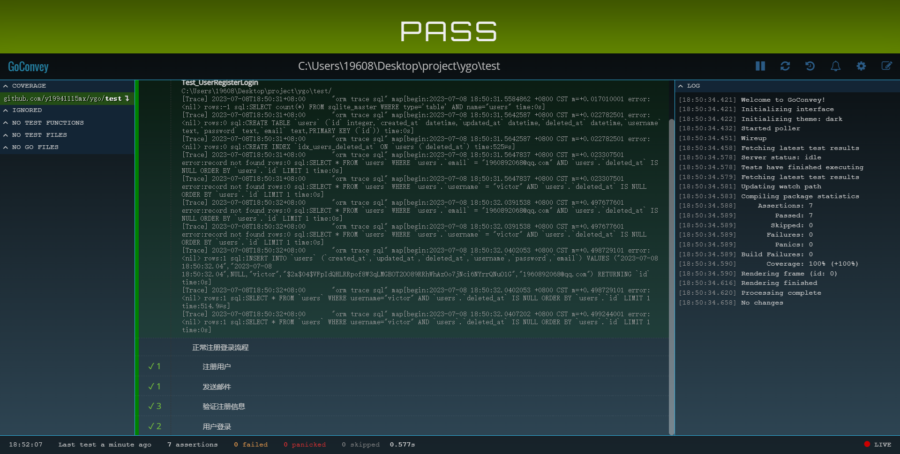

# Ygo 框架
## 使用文档

[《Ygo框架使用文档》](https://y19941115mx.netlify.app/)

## 使用说明

### 框架安装

编译环境依赖：
1. go 开发环境
2. gcc 开发环境

远程编译安装
```
go install github.com/y19941115mx/ygo@latest 
```

本地编译安装
```
cd 项目根路径
go install
```
### 使用

如果编译安装成功，运行 `ygo` 命令，即可直接查看框架命令的使用介绍


如本地编译失败，请到 [release页面](https://github.com/y19941115mx/ygo/releases) 下载对应操作系统的可执行文件，并将可执行文件的路径添加到系统的环境变量中

### 运行

```
ygo app start
```
访问浏览器[127.0.0.1:8888/swagger/index.html](127.0.0.1:8888/swagger/index.html) 即可访问demo的接口文档：


### 运行测试用例

编辑文件`test/env.go`，设置项目根路径地址`BasePath`

```
cd test

go test -v
```
启动可视化测试页面
1. 安装 goconvey 
   `go install github.com/smartystreets/goconvey`
2. 执行命令,启动可视化测试web服务
    ```
    cd test

    goconvey
    ```
3. 访问web服务:
   [http://127.0.0.1:8080](http://127.0.0.1:8080/)


### 参与贡献

1.  Fork 本仓库
2.  新建 Feat_xxx 分支
3.  提交代码
4.  新建 Pull Request

